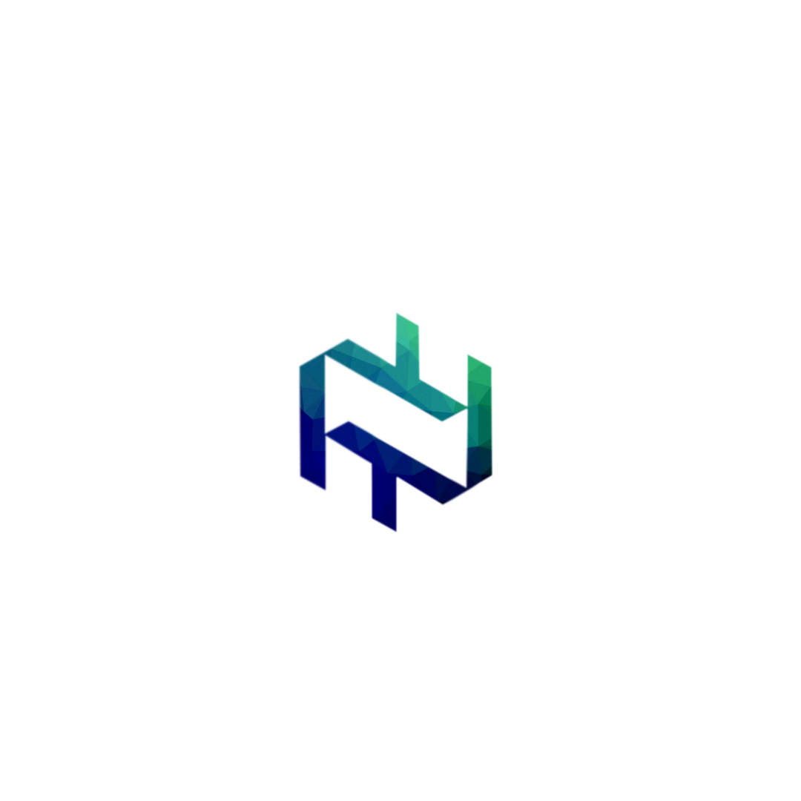

### Hi there, I'm Neel Thakkar - aka [NT]

## I'm a student, Learner and Developer!

- :innocent: I'm currently working on a project callled [Rangrezz-Pro][https://github.com/neel278/rangrezz-pro]!
- :smiley: I'm currently learning everything
- :runner: I'm looking to collabrote with other content creators
- :collision: 2020 Goals: Learning Vuejs with laravel
- :grin: Fun Fact: I love to talk to my self!

### Connect with me:

[][https://github.com/neel278]
[][https://twitter.com/278neel]
[][https://www.linkedin.com/in/neel-thakkar-1221a0194/]

 

### Languages and Tools
